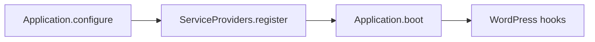
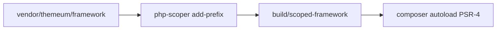
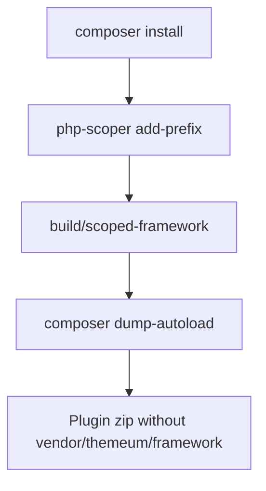

# themeum/framework

Laravel-inspired PHP framework for building WordPress plugins. It provides a service container, HTTP layer, validation, database abstractions, WordPress hook integration, scheduling, and WP-CLI tooling so plugin code can stay structured and testable.

**Package:** `themeum/framework`  
**Namespace (library source):** `Framework\`  
**License:** GPL-2.0-or-later  
**Homepage:** https://github.com/themeum/framework

---

## Table of contents

1. [Requirements](#requirements)
2. [Installation](#installation)
3. [Quick start](#quick-start)
4. [Architecture overview](#architecture-overview)
5. [Namespace prefixing with PHP-Scoper](#namespace-prefixing-with-php-scoper)
6. [License](#license)

---

## Requirements

- PHP `>= 7.0`
- WordPress (for runtime integration: hooks, REST API, options, users, etc.)
- [Composer](https://getcomposer.org/) in consumer plugins

---

## Installation

`themeum/framework` is distributed from a **private GitHub repository**, not Packagist. Consumer plugins install it over **SSH** using the developer’s (or CI deploy key’s) GitHub SSH access—no Composer `github-oauth` token is required.

### 1. One-time SSH setup (each machine)

1. [Create an SSH key](https://docs.github.com/en/authentication/connecting-to-github-with-ssh/generating-a-new-ssh-key-and-adding-it-to-the-ssh-agent) if you do not already have one.
2. [Add the public key](https://docs.github.com/en/authentication/connecting-to-github-with-ssh/adding-a-new-ssh-key-to-your-github-account) to your GitHub account.
3. Confirm your GitHub user has access to the private `themeum/framework` repository.
4. Verify SSH works:

```bash
ssh -T git@github.com
```

You should see a successful authentication message for your GitHub user.

### 2. Register the repository (SSH VCS URL)

In your plugin’s `composer.json`, point Composer at the private repo using the SSH URL:

```json
{
  "repositories": [
    {
      "type": "vcs",
      "url": "git@github.com:themeum/framework.git"
    }
  ],
  "require": {
    "themeum/framework": "^1.0"
  }
}
```

Pin a specific release with tags on the framework repo (recommended for production):

```json
"require": {
  "themeum/framework": "1.0.0"
}
```

Or track a branch during development (may require `"minimum-stability": "dev"` and `"prefer-stable": true`):

```json
"require": {
  "themeum/framework": "dev-main"
}
```

### 3. Install the package

After `repositories` and `require` are in `composer.json` (step 2), install from the plugin root:

```bash
composer install
```

`composer require themeum/framework` does **not** work on its own: the package is not on Packagist, so Composer must already know the private VCS repository from `composer.json`.

Composer clones over SSH into `vendor/themeum/framework/`, maps `Framework\` to `src/`, and autoloads `src/helpers.php`.

### 4. Verify the install

```bash
composer show themeum/framework
```

You should see the installed version and source reference (commit or tag). If install fails, confirm the SSH URL, run `ssh -T git@github.com`, and ensure your account can read the private repository.

### 5. CI / release builds (SSH deploy key)

Pipelines cannot use a developer’s personal SSH key. Add a **read-only deploy key** to the `themeum/framework` repository (or use a machine account key), store the private key as a CI secret, and load it before `composer install`:

```bash
eval "$(ssh-agent -s)"
ssh-add - <<< "${FRAMEWORK_DEPLOY_KEY}"
ssh-keyscan github.com >> ~/.ssh/known_hosts
composer install --no-dev --prefer-dist
```

Keep the same SSH VCS URL in `composer.json` (`git@github.com:themeum/framework.git`). Do not commit private keys or tokens to the repository.

> **Important:** The namespace `Framework\` is correct when you work **inside this library repository**. Plugins that ship to production must **not** load unscoped `Framework\` on a site where another plugin may bundle a different version. See [Namespace prefixing with PHP-Scoper](#namespace-prefixing-with-php-scoper).

---

## Quick start

### Bootstrap the application

In a consumer plugin, use your **prefixed** application class (after PHP-Scoper). The example below uses a generic `{NamespacePrefix}\Framework` placeholder:

```php
<?php

use {NamespacePrefix}\Framework\Application;

$app = Application::configure(__DIR__)
    ->use_prefix('your_plugin')
    ->use_routing(__DIR__ . '/routes/api.php');

$app->boot();
```

Call `boot()` once inside WordPress’s `init` hook so service providers run and WordPress hooks registered by the framework can attach.

### Application lifecycle



On construction, the application:

1. Registers core bindings and service providers (`FileSystemServiceProvider`, `CoreServiceProvider`, `HookServiceProvider`).
2. Loads `bootstrap/providers.php` if present and registers each listed provider.
3. Loads `bootstrap/aliases.php` if present for container aliases.

`boot()` runs provider `boot()` methods and fires `booting` / `booted` callbacks.

### Service providers

Create `bootstrap/providers.php` returning an array of provider class names:

```php
<?php

return [
    {NamespacePrefix}\App\Providers\AppServiceProvider::class,
];
```

Each provider must extend `{NamespacePrefix}\Framework\ServiceProvider` (prefixed `Framework\ServiceProvider`) and implement `register()`. Optional `boot()` runs after the application boots.

### Routing

Include a route file via `use_routing()`. Routes use the static `Route` API and are registered on WordPress `rest_api_init` through the framework’s hook layer.

```php
<?php

use {NamespacePrefix}\Framework\Route;

Route::prefix('your-plugin/v1')->group(function () {
    Route::get('/items', [ItemController::class, 'index']);
});
```

### Container and helpers

Resolve services from the container:

```php
$app = \{NamespacePrefix}\Framework\app();
$user = \{NamespacePrefix}\Framework\app({NamespacePrefix}\Framework\Wordpress\User::class);
```

Common global helpers (defined in `helpers.php`, prefixed in production):

| Helper | Purpose |
|--------|---------|
| `app()` | Application / container resolution |
| `config()` | Load config PHP files from the config path |
| `response()` | HTTP response builder |
| `user()` | WordPress user wrapper |
| `settings()` | App settings facade |
| `with_prefix()` / `without_prefix()` | Option/meta key prefixing |
| `base_path()`, `app_path()`, `config_path()`, `database_path()`, … | Path helpers |
| `collection()` | Collection instance |
| `migrator()` | Database migrator |

### WP-CLI

When `WP_CLI` is defined, the framework registers commands such as `migrate`, `make:model`, `make:controller`, `make:migration`, `db:seed`, and `migrate:fresh`. Run them from the plugin directory with WP-CLI pointed at your WordPress install.

### Working on this library repo

Contributors working directly in `themeum/framework` use unscoped namespaces:

```php
use Framework\Application;

$app = Application::configure(__DIR__)->boot();
```

Do not ship that pattern inside a distributed plugin zip.

---

## Architecture overview

High-level map of major modules. For implementation detail, browse the linked paths under `src/`.

### Container and application

| Component | Path |
|-----------|------|
| Application (container + bootstrap) | [`src/Application.php`](src/Application.php) |
| Container | [`src/Container.php`](src/Container.php) |
| Service provider base | [`src/ServiceProvider.php`](src/ServiceProvider.php) |
| Core provider | [`src/CoreServiceProvider.php`](src/CoreServiceProvider.php) |

The application is a singleton (`Application::get_instance()` / `configure()`). It manages paths, option key prefixes (`use_prefix()`), service registration, and boot callbacks.

### HTTP

| Component | Path |
|-----------|------|
| Request | [`src/Http/Request.php`](src/Http/Request.php) |
| Response / JSON | [`src/Http/Response.php`](src/Http/Response.php), [`src/Http/JsonResponse.php`](src/Http/JsonResponse.php) |
| HTTP client | [`src/Http/Client/`](src/Http/Client/) |

Incoming REST traffic is handled through route actions; responses support headers and JSON encoding.

### Routing and middleware

| Component | Path |
|-----------|------|
| Route registrar | [`src/Route.php`](src/Route.php) |
| Auth middleware | [`src/Middlewares/AuthMiddleware.php`](src/Middlewares/AuthMiddleware.php) |

Routes are grouped, prefixed, and bound to controller methods. REST registration is triggered from [`RegisterRestApi`](src/Wordpress/Hooks/Actions/RegisterRestApi.php).

### Validation

| Component | Path |
|-----------|------|
| Validator | [`src/Validation/Validator.php`](src/Validation/Validator.php) |
| Rules | [`src/Validation/Rules/`](src/Validation/Rules/) |

Rule-based validation for requests and arrays, similar in spirit to Laravel validators.

### Database

| Component | Path |
|-----------|------|
| Connection / manager | [`src/Database/Connection/`](src/Database/Connection/) |
| Query builder / model | [`src/Database/Query/`](src/Database/Query/) |
| Migrations | [`src/Database/Migrations/`](src/Database/Migrations/) |
| Schema | [`src/Database/Schema/`](src/Database/Schema/) |

Eloquent-style models, relationships, migrations, and schema management for custom tables.

### WordPress integration

| Component | Path |
|-----------|------|
| Hook service provider | [`src/Wordpress/HookServiceProvider.php`](src/Wordpress/HookServiceProvider.php) |
| Actions / filters | [`src/Wordpress/Hooks/`](src/Wordpress/Hooks/) |
| User, menu, customer | [`src/Wordpress/`](src/Wordpress/) |

Register hooks in `config/hooks.php`:

```php
<?php

return [
    'actions' => [
        {NamespacePrefix}\App\Hooks\SomeAction::class,
    ],
    'filters' => [],
];
```

Hook classes extend the framework hook base types and declare hook name, priority, and handler.

### Facades

Static entry points to container bindings: `DB`, `Http`, `Log`, `Event`, `File`, `Schema`, `Option`, `Command`, and others under [`src/Supports/Facades/`](src/Supports/Facades/). Base class: [`src/Facade.php`](src/Facade.php).

### Scheduler / queue

Deferred and queued jobs: [`src/Scheduler/`](src/Scheduler/) (`Dispatchable`, `ShouldQueue`, queue repository, runner). Use when work should run outside the current request.

### Console

WP-CLI commands and stubs for code generation: [`src/Console/`](src/Console/). Stubs live in [`src/Console/stubs/`](src/Console/stubs/).

### Global helpers

All functions in [`src/helpers.php`](src/helpers.php) live in the `Framework\` namespace (e.g. `Framework\app()`). After prefixing, use the matching prefixed names in plugin code (see below).

---

## Namespace prefixing with PHP-Scoper

This section is required reading for **every** plugin that bundles `themeum/framework` and may coexist with another plugin using the same library.

### Why prefix?

On a single WordPress site, a user may activate multiple plugins that depend on `themeum/framework` (for example **Kirki** and **Kirki Ecommerce**). Each plugin may ship a **different version** of the library.

If both load classes under the raw namespace `Framework\`:

- PHP fatals with **cannot redeclare class** (or incompatible behavior if load order “wins”).
- Global helpers guarded by `function_exists('Framework\app')` only register once.
- Container singletons and types are not isolated per plugin.

**Solution:** each plugin runs [PHP-Scoper](https://github.com/humbug/php-scoper) in its **own CI/release pipeline**, vendors a **private prefixed copy**, and authors write code against that prefix only.

Plugins do **not** share one framework instance across each other. Isolation is intentional.

### How PHP-Scoper works

PHP-Scoper is **not** a Composer package rename. It is a **build-time tool** that:

1. **Reads** PHP files you point at (via `scoper.inc.php` finders—here, only `vendor/themeum/framework`).
2. **Rewrites** namespaces, class names, function names, and some strings inside those files according to a `prefix` you choose.
3. **Writes** new files into an **output directory**. It does **not** modify `vendor/themeum/framework` in place.

Think of it as copying the framework into a separate folder and running a safe search-and-replace across the AST (syntax tree), so PHP sees `Kirki\Framework\Application` instead of `Framework\Application`.

**Input (after `composer install` in the plugin repo):**

```text
your-plugin/
  vendor/themeum/framework/          ← original, unscoped (dev/CI only)
    src/
      Application.php                  namespace Framework;
      Http/Request.php                 namespace Framework\Http;
      helpers.php                      function Framework\app() { ... }
  scoper.inc.php
```

**Command (from the plugin root):**

```bash
vendor/bin/php-scoper add-prefix --config=scoper.inc.php --force
```

`--force` overwrites the output folder on each CI run. `--config` points at your `scoper.inc.php` (prefix, finders, output directory).

**Output (what creates `build/scoped-framework/`):**

The folder name is **not automatic magic**—you define it with `output-dir` in `scoper.inc.php` (or `--output-dir=build/scoped-framework` on the CLI). If you omit both, PHP-Scoper defaults to `./build`.

After a successful run with `'output-dir' => 'build/scoped-framework'` and `'prefix' => 'Kirki'`:

```text
your-plugin/
  build/scoped-framework/              ← generated; ship this, not vendor/themeum/framework
    src/
      Application.php                  namespace Kirki\Framework;
      Http/Request.php                 namespace Kirki\Framework\Http;
      helpers.php                      function Kirki\Framework\app() { ... }
```

That `build/scoped-framework/` tree is what your plugin **autoloads in production** (see below). Your own plugin code under `app/` is **not** run through Scoper—you already author it as `Kirki\Framework\...`.



### Before and after (one file)

**Before** (`vendor/themeum/framework/src/Http/Request.php`):

```php
namespace Framework\Http;

use Framework\Contracts\Request as RequestContract;
```

**After** (`build/scoped-framework/src/Http/Request.php`, prefix `Kirki`):

```php
namespace Kirki\Framework\Http;

use Kirki\Framework\Contracts\Request as RequestContract;
```

The same transformation applies to every PHP file matched by your finders, including `helpers.php` (`Framework\app` → `Kirki\Framework\app`).

### Prefix convention

Map the library namespace:

```text
Framework\  →  {PluginRootNamespace}\Framework\
```

| Plugin | Example class | Scoper `prefix` (typical) |
|--------|----------------|-------------------------|
| Kirki | `Kirki\Framework\Http\Request` | `Kirki` |
| Kirki Ecommerce | `Kirki\Ecommerce\Framework\Http\Request` | `Kirki\Ecommerce` |

Use the Scoper `prefix` value that prepends to `Framework` so you get `{Prefix}\Framework\...`, not a duplicated `Framework\Framework` segment. Validate the output tree in CI before release.

### Recommended CI pipeline



**Steps:**

1. Add `humbug/php-scoper` as a **dev dependency** in the consumer plugin.
2. Add `scoper.inc.php` at the plugin root (see examples below) with:
   - `prefix` — e.g. `Kirki` or `Kirki\Ecommerce`
   - `output-dir` — e.g. `build/scoped-framework` (this is where the prefixed copy is written)
   - `finders` — only `vendor/themeum/framework`
3. Run `composer install` (SSH access to the private framework repo) so `vendor/themeum/framework` exists.
4. Run Scoper:

```bash
vendor/bin/php-scoper add-prefix --config=scoper.inc.php --force
```

5. Confirm `build/scoped-framework/src/` exists and contains prefixed PHP (open one file and check the `namespace` line).
6. Point the plugin’s `composer.json` `autoload` at `build/scoped-framework/src/` (not at `vendor/themeum/framework`).
7. Run `composer dump-autoload` so the classmap matches the prefixed tree.
8. Build the release zip with `build/scoped-framework/` and your plugin code. **Exclude** unscoped `vendor/themeum/framework` from what you ship.

**Do not commit** `build/scoped-framework/`—generate it on every CI/release run.

### Local development

Development uses the **same autoload target as production**: `build/scoped-framework/`. There is no separate “dev namespace” inside the framework—your plugin always references `{NamespacePrefix}\Framework\...`, and PHP always loads those classes from the **scoped** tree.

**What happens on your machine**

```text
composer install          →  vendor/themeum/framework/     (unscoped input, not autoloaded)
php-scoper add-prefix     →  build/scoped-framework/     (prefixed copy, autoloaded)
WordPress loads plugin    →  Kirki\Framework\... resolves from build/scoped-framework/
```

`vendor/themeum/framework` exists locally so Scoper has source to read. It must **not** be registered in `composer.json` autoload alongside the scoped copy, or PHP will load both and you risk redeclare errors.

**After every install or update of the framework**, regenerate the scoped tree:

```bash
composer install
vendor/bin/php-scoper add-prefix --config=scoper.inc.php --force
composer dump-autoload
```

Automate that with Composer scripts in the consumer plugin:

```json
{
  "scripts": {
    "scope-framework": [
      "@php vendor/bin/php-scoper add-prefix --config=scoper.inc.php --force"
    ],
    "post-install-cmd": ["@scope-framework"],
    "post-update-cmd": ["@scope-framework"]
  }
}
```

Add `build/scoped-framework/` to `.gitignore`. Each developer (and CI) generates it locally; it is not committed.

**Typical dev loop**

1. Clone the plugin repo and configure SSH for the private framework repo.
2. Run `composer install` (runs Scoper via `post-install-cmd` if scripts are configured).
3. Point WordPress at the plugin; bootstrap uses `{NamespacePrefix}\Framework\Application` and `boot()` on `init`.
4. When bumping `themeum/framework`, run `composer update themeum/framework`—Scoper runs again and refreshes `build/scoped-framework/`.

**Framework `is_dev_mode()`**

Features such as listener/policy discovery may call `app()->is_dev_mode()`. That is **not** defined by PHP-Scoper. Register it on the application in your plugin bootstrap (for example map it to `WP_DEBUG`):

```php
use {NamespacePrefix}\Framework\Application;

$app = Application::configure(__DIR__);
$app->macro('is_dev_mode', fn () => defined('WP_DEBUG') && WP_DEBUG);
```

**Working on the library itself**

If you are changing `themeum/framework` source, work in **this** repository with unscoped `Framework\` and its own Composer autoload—not inside a consumer plugin’s scoped build.

### Autoload after Scoper

Map the prefixed namespace to the scoped folder (paths are examples—adjust to your build output):

**Kirki**

```json
{
  "autoload": {
    "psr-4": {
      "Kirki\\Framework\\": "build/scoped-framework/src/"
    },
    "files": [
      "build/scoped-framework/src/helpers.php"
    ]
  }
}
```

**Kirki Ecommerce**

```json
{
  "autoload": {
    "psr-4": {
      "Kirki\\Ecommerce\\Framework\\": "build/scoped-framework/src/"
    },
    "files": [
      "build/scoped-framework/src/helpers.php"
    ]
  }
}
```

Run `composer dump-autoload` in CI after Scoper so the classmap matches the prefixed tree.

### Example `scoper.inc.php` (illustrative)

Adapt paths and exclusions to your plugin layout and Scoper version. See the [official PHP-Scoper documentation](https://github.com/humbug/php-scoper/blob/master/docs/configuration.md) for `finders`, `exclude-files`, and stub handling.

**Kirki**

```php
<?php

declare(strict_types=1);

use Isolated\Symfony\Component\Finder\Finder;

return [
    'prefix' => 'Kirki',
    'output-dir' => 'build/scoped-framework',

    'finders' => [
        Finder::create()
            ->files()
            ->in(__DIR__ . '/vendor/themeum/framework')
            ->exclude(['tests', 'test', 'Tests'])
            ->name('*.php'),
    ],

    'exclude-files' => [
        // Add vendor files that must not be transformed, if any.
    ],
];
```

**Kirki Ecommerce**

```php
<?php

declare(strict_types=1);

use Isolated\Symfony\Component\Finder\Finder;

return [
    'prefix' => 'Kirki\Ecommerce',
    'output-dir' => 'build/scoped-framework',

    'finders' => [
        Finder::create()
            ->files()
            ->in(__DIR__ . '/vendor/themeum/framework')
            ->exclude(['tests', 'test', 'Tests'])
            ->name('*.php'),
    ],
];
```

WordPress and WP-CLI stubs (`php-stubs/wordpress-stubs`, etc.) should remain **dev-only** in the consumer plugin. Configure Scoper exclusions so stubs are not bundled into the scoped production tree.

### Coding rules in plugin source

1. **Classes:** import and type-hint prefixed FQCNs only (e.g. `Kirki\Framework\Http\Request`).
2. **Application:** extend or configure `Kirki\Framework\Application`, not `Framework\Application`, in shipped code.
3. **Service providers:** extend `Kirki\Framework\ServiceProvider` (or your ecommerce prefix).
4. **Facades:** reference `Kirki\Framework\Supports\Facades\Http` (etc.).
5. **Helpers:** call prefixed functions with a leading backslash:

```php
\Kirki\Framework\app();
\Kirki\Framework\config('app.name');
\Kirki\Framework\response()->json(['ok' => true]);
```

6. **Never** reference unscoped `Framework\` in code that ships to users.

Plugin PHP source should be authored in the **final prefixed namespace** from day one so local analysis matches production.

### Scoping dependencies

This workflow scopes **only** `vendor/themeum/framework`. Other Composer packages (including `fakerphp/faker`, required by the framework) stay in `vendor/` **unprefixed**.

| Risk | Mitigation |
|------|------------|
| Two plugins load different Faker versions | Align `fakerphp/faker` constraints across plugins, or avoid calling `faker()` in production |
| Autoload conflicts for other vendors | Keep third-party packages out of the Scoper finder; scope only `themeum/framework` |

If a dependency must be isolated the same way, scope it in a **separate**, documented Scoper run—do not assume the framework prefix covers `vendor/fakerphp`.

### Troubleshooting

| Symptom | Likely cause |
|---------|----------------|
| `Cannot redeclare class Framework\...` | Unscoped `vendor/themeum/framework` still autoloaded alongside scoped code |
| `Class Kirki\Framework\... not found` | PSR-4 path does not match CI output directory, or `composer dump-autoload` not run on scoped tree |
| `Call to undefined function Framework\app()` | `helpers.php` missing from `autoload.files`, or code still calling unprefixed `Framework\app()` |
| Two plugins “fight” over one framework | Expected; each plugin needs its own prefixed copy and its own `Application` instance |
| Types from plugin A not compatible with plugin B’s framework classes | Expected; do not pass framework objects across plugins |

---

## License

This library is licensed under the **GNU General Public License v2.0 or later**. See [composer.json](composer.json) and https://www.gnu.org/licenses/gpl-2.0.html.

---

## Contributing

Issues and pull requests: https://github.com/themeum/framework

When contributing to the library itself, use the `Framework\` namespace and standard Composer autoloading from this repository. Consumer plugins follow the [PHP-Scoper](#namespace-prefixing-with-php-scoper) workflow above.
